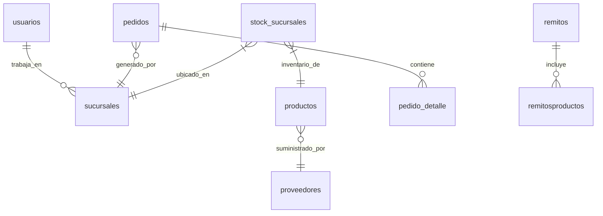

# 📜 Miscelanius

## 🔄 **Virtual enviroment**
| Comando | Descripción |
|---------|-------------|
# | `python -m venv .venv` | 
# | `.venv\Scripts\activate.bat` |  

---
## Reflex
# | `pip install reflex` |
# | `reflex init` |
# | `reflex run` |
# | `reflex run --loglevel debug` |

### 🔍 TREE Estructura inicial

```sql
example-big-app/
├─ assets/
├─ example_big_app/
│  ├─ components/
│  │  ├─ __init__.py
│  │  ├─ auth.py
│  │  ├─ menu.py
│  ├─ pages/
│  │  ├─ __init__.py
│  │  ├─ index.py
│  │  ├─ login.py
│  │  ├─ product.py
│  ├─ __init__.py
│  ├─ example_big_app.py
│  ├─ models.py
│  ├─ state.py
│  ├─ template.py
├─ uploaded_files/
├─ requirements.txt
├─ rxconfig.py
```




